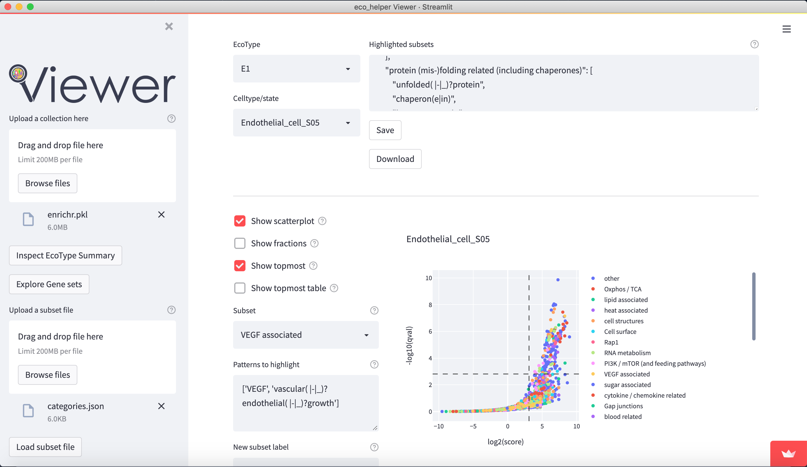
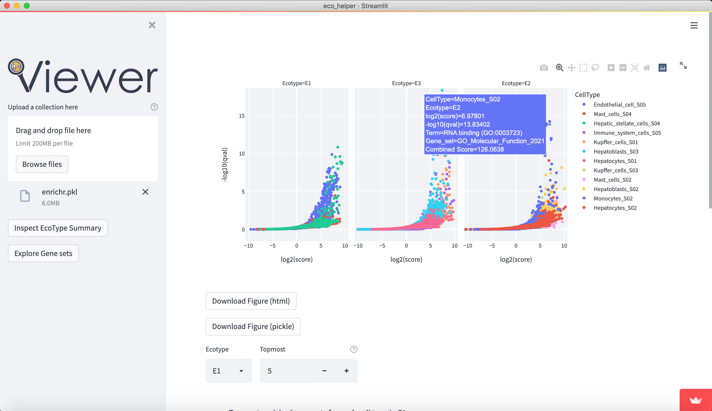

<p align="center">

</p>

---

[](https://noahhenrikkleinschmidt-eco-helper-viewer-srcmain-8ju43d.streamlit.app)


This is the web-viewer provided by [eco_helper](https://github.com/NoahHenrikKleinschmidt/eco_helper) to inspect gene set enrichment results from [EcoTyper](https://github.com/digitalcytometry/ecotyper) analyses. 

### Online version

The web-viewer is hosted on *streamlit* and can be directly [accessed here](https://noahhenrikkleinschmidt-eco-helper-viewer-srcmain-8ju43d.streamlit.app) or via the badge above. 

### Running locally

Alternatively the web-viewer can be run locally by first cloning this repository, creating an environment with the necessary dependencies, and then running 

```bash
streamlit run src/main.py
```

from the repository root directory. By default the web-viewer is then available at `localhost:8501`. 

### Functionalities

The web-viewer allows an interactive overview of the enriched gene-sets in each celltype/state in each EcoType. It visualises volcano-plots and bubble plots of topmost enriched gene-sets. It allows highlighting of gene-set subsets through regex-pattern to better understand the behaviour of a particular celltype/state in a given EcoType - e.g. highlight terms associated with apoptosis through (python-style) regex-patterns such as `["apopto(sis|tic)( |-)(regulation)?", "cell( |-)death"]`. There are dedicated input fields for adding/editing such subsets and a python dictionary of pre-existing patterns can be loaded.

Figures are available both interactively through `plotly` and statically through `matplotlib`. Figures can be downloaded in html (plotly), png (both), and as pickle files (both) which contains the respective python figure object directly, so the user may later edit the figures to their liking.

### Screenshots







### Input Data

The web-viewer requires a `pickle` file as input. This should store a single `eco_helper.EnrichmentCollection` object. This can be easily generated by the `eco_helper enrich` command using the `--pickle` option.

However, in case your data was not generated with the help of `eco_helper`, a `dictionary` of `pandas.DataFrames` should also work as well. The _keys_ are the designated Ecotype labels and the _values_  (pandas dataframes) summarize all the celltypes/states and their enriched gene sets associated with the EcoType.

For the app to work properly the dataframes must contain at least the following columns (named exactly like this):

- `CellType` (celltype/state annotation) 
- `Term` (enriched gene-set label)
- `log2_score` (enrichment score log2-transformed)
- `log10_qval` (adj. p-value log10-transformed)

The dataframes can contain any additional columns and the columns used for plotting can be changed in the app later.

